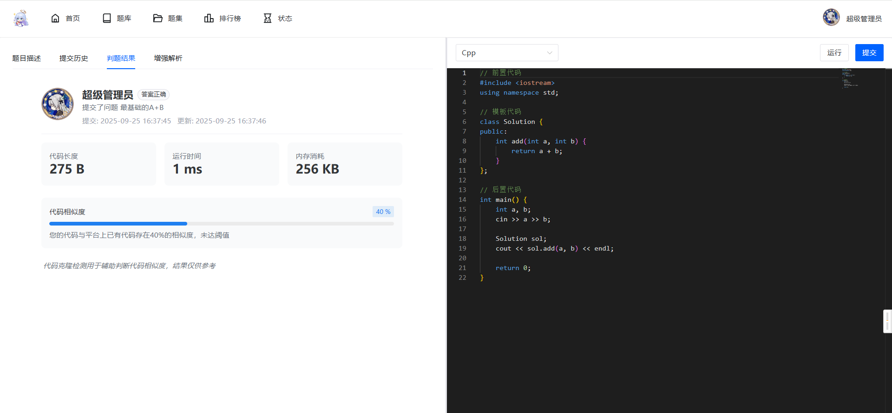

    

# Astro Code OJ

## 🌟 项目简介

Astro Code OJ 是一款基于 Java 生态与 Vue 3 构建的在线评测系统，提供从题目管理、代码评测到用户体系的全流程解决方案。系统融合了 AI 辅助编程能力，支持多语言代码实时评测，为编程学习、算法训练提供学习平台。

## 🚀 核心特性

### 核心功能

- **📚 完善的题目体系**：支持题目增删改查、分类标签、样例管理与难度分级
- **⚡ 多语言评测引擎**：支持 C/C++、Java、Python、Go 等主流编程语言
- **👥 用户管理**：角色权限控制、用户排名、进度跟踪与学习统计
- **🤖 AI 智能辅助**：集成 DashScope AI 接口，提供题目解析、代码优化建议
- **📦 灵活的题集管理**：支持自定义题集创建、学习进度追踪与批量评测
- **🔄 异步任务处理**：基于 RabbitMQ 的分布式评测任务调度，支持高并发场景

## 🛠️ 技术栈

### 后端技术

| 技术              | 说明        |
|-----------------|-----------|
| Java 21         | 核心开发语言    |
| Spring Boot 3.x | 应用开发框架    |
| Spring Cloud    | 微服务架构支持   |
| MyBatis Plus    | ORM 框架    |
| Redis           | 缓存与会话存储   |
| RabbitMQ        | 消息队列      |
| Nacos           | 配置中心与服务发现 |
| GoZero          | 高性能微服务框架  |

### 前端技术

| 技术            | 说明    |
|---------------|-------|
| Vue 3         | 前端框架  |
| TypeScript    | 类型系统  |
| Vite          | 构建工具  |
| Naive UI      | 组件库   |
| Pinia         | 状态管理  |
| Vue Router    | 路由管理  |
| Monaco Editor | 代码编辑器 |

## 🖼️ 界面预览

| 功能模块  | 预览图                                 |
|-------|-------------------------------------|
| 系统首页  |      |
| 题库浏览  |      |
| 用户排行  |     |
| 提交状态  |    |
| 题目管理  |    |
| 系统配置  |    |
| 代码提交  |    |
| 评测结果  |    |
| AI 辅助 |  |

## 📋 快速开始

### 环境要求

- **后端**：JDK 21+, MySQL 8.0+, Redis 6.0+, RabbitMQ 3.8+
- **前端**：Node.js 18+, pnpm
- **构建工具**：Maven 3.8+, Docker 20.10+ (可选)

### 一键部署（Docker Compose）

> 暂时不支持一键部署

## 📖 使用文档

> 待完善

## 🎯 应用场景

- 高校编程教学与作业评测
- 算法训练平台搭建
- 个人编程技能训练

## 🔧 扩展与定制

- **评测语言扩展**：通过配置添加新的编程语言支持
- **存储方案定制**：支持本地存储、MinIO 等多种存储方案

---

⭐️ 如果这个项目对你有帮助，请给我们一个 Star！
