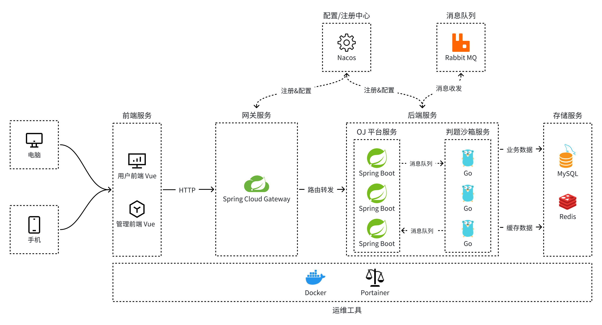
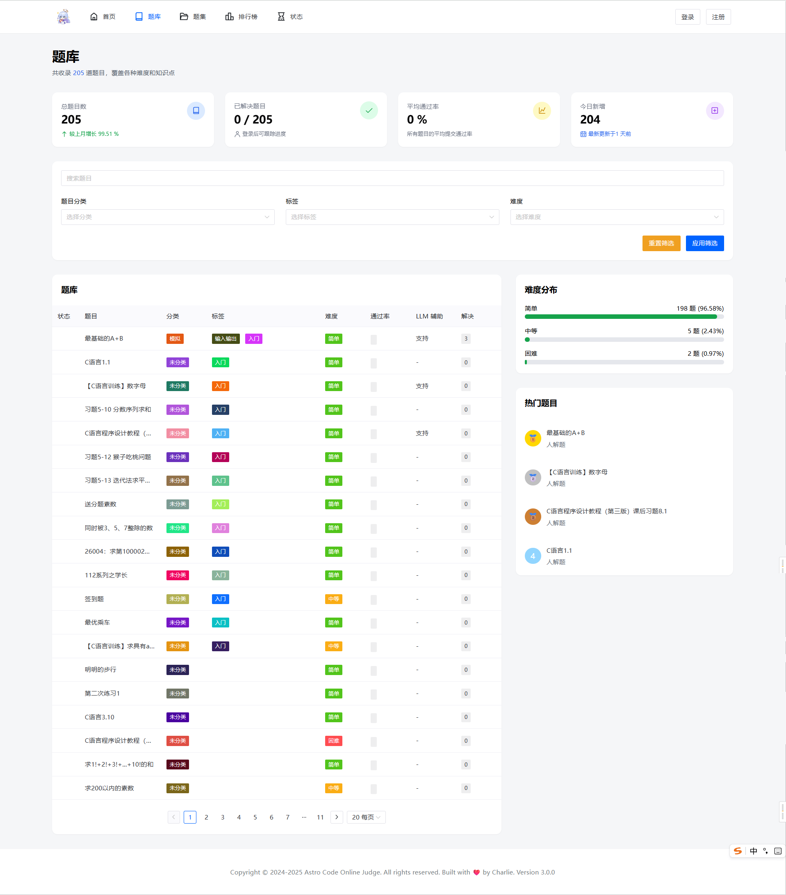
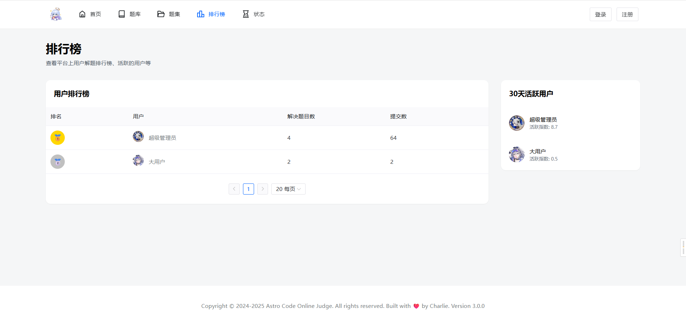
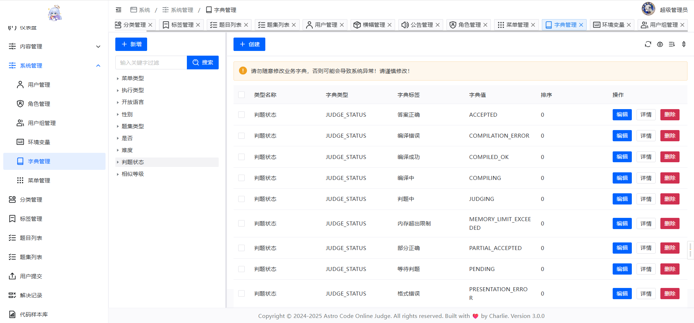
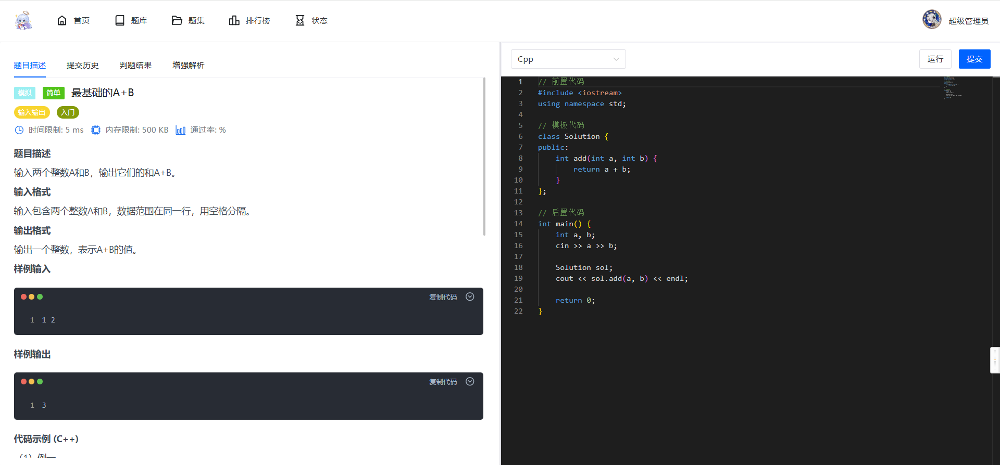

# Astro Code OJ 系统文档

## 项目简介

Astro Code OJ 是一个基于 Java 的在线评测系统，支持题目管理、用户管理、题集管理、代码提交与评测、AI 聊天辅助等功能。系统采用 Spring Boot + MyBatis Plus 构建后端服务，前端使用 Vue 3 + TypeScript + Vite 构建管理界面。

- **题目管理**：支持题目增删改查、代码提交与评测。
- **题集管理**：支持题集创建、进度跟踪、提交与评测。
- **用户管理**：支持用户注册、登录、用户管理。
- **系统管理**：支持公告、横幅、配置、字典、角色等系统级管理。
- **AI 聊天**：集成 DashScope AI 接口，提供题目解析辅助。
- **文件管理**：支持文件上传、预览。
- **消息队列**：使用 RabbitMQ 实现异步评测任务处理。

## 技术栈

### 后端
- Java 21
- Spring Boot
- MyBatis Plus
- Redis
- RabbitMQ
- Nacos
- Maven
- Spring Cloud

### 前端
- Vue 3
- TypeScript
- Vite
- Naive UI
- Vue Router
- Pinia

## 系统架构

## 预览

**首页**

**题库**

**排行榜**

**提交状态**

**题目管理**

**字典管理**

**提交页**

代码提交

测评结果

LLM 辅助

## 贡献指南

欢迎贡献代码，请遵循以下流程：

1. Fork 本项目
2. 创建新分支（feature/xxx）
3. 提交 Pull Request
4. 等待审核与合并

## 许可证

本项目采用 [MIT License](https://opensource.org/licenses/MIT)，欢迎自由使用与修改。

## 联系方式

如有问题，请联系项目维护者或提交 Issue。